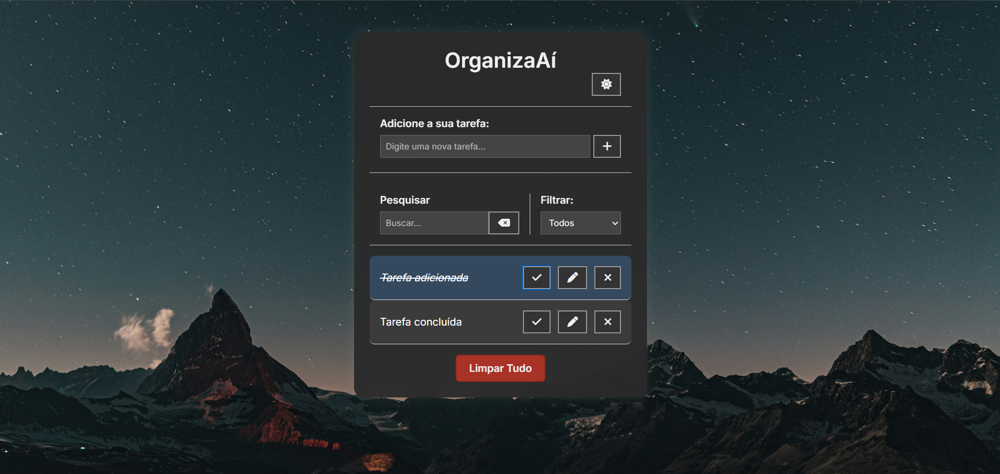

# 📝 OrganizaAí

OrganizaAí é uma aplicação de lista de tarefas simples, funcional e responsiva desenvolvida com **HTML**, **CSS** e **JavaScript**. Ideal para treinar conceitos de manipulação do DOM, localStorage, responsividade, modo escuro e animações. Criado com o objetivo de melhorar o portfólio pessoal.

 <!-- Substitua pelo caminho correto ou remova se não tiver imagem -->

---

## ⚙️ Funcionalidades

- Adicionar tarefas com validação de campo vazio
- Editar tarefas existentes
- Marcar como concluída ou reverter tarefa
- Remover tarefa com animação suave
- Limpar todas as tarefas com confirmação e animação
- Filtro por status: todos, concluídos ou pendentes
- Busca dinâmica de tarefas
- Alternância entre tema claro e escuro com ícone
- Animações de entrada e saída das tarefas
- Armazenamento local via **localStorage**
- Design responsivo para diferentes tamanhos de tela

---

## 💻 Tecnologias Utilizadas

- HTML5
- CSS3
- JavaScript (ES6+)
- [Font Awesome](https://fontawesome.com/) (ícones)

---

## 📂 Estrutura de Pastas

```
organiza-ai/
├── index.html
├── css/
│   └── styles.css
├── js/
│   └── scripts.js
├── img/
│   └── céu_noite.jpg
└── README.md
```

---

## 🚀 Como Executar Localmente

1. Clone o repositório:

   ```bash
   git clone https://github.com/gabrielsilvacodes/organiza-ai.git
   ```

2. Navegue até a pasta do projeto:

   ```bash
   cd organiza-ai
   ```

3. Abra o `index.html` no seu navegador:
   - Clique duas vezes no arquivo, ou
   - Execute com extensão como o **Live Server** no VS Code

---

## 📱 Responsividade

O layout se adapta a diferentes tamanhos de tela, com media queries específicas para:

- até **500px** (mobile)
- até **768px** (tablet)
- até **1024px** (notebooks)

---

## 🌙 Modo Escuro

O tema escuro é ativado com um botão no canto superior. A escolha do tema é salva automaticamente no **localStorage** e mantida na próxima visita.

---

## 📌 Licença

Este projeto está licenciado sob a **MIT License** — sinta-se livre para usar, modificar e compartilhar.

---

## 👨‍💻 Autor

Feito com dedicação por **[Gabriel Silva](https://github.com/gabrielsilvacodes)**
🔗 [LinkedIn](www.linkedin.com/in/gabriel-oliveiradev)
